# 👋 Hey, I'm M. Aditya Patra

🎓 3rd Year **Computer Science Engineering** student at DY Patil International University, Pune 
🏎️ Building **BoxBox** — an F1 race strategy & tire degradation dashboard powered by 6 ML models and SHAP 
📊 Skilled in **Data Analysis, Machine Learning & Data Visualization** 
🚀 Focused on Data Analytics, ML Engineering, and Software Development

---

## 🏆 Featured Projects

### 🏎️ [BoxBox](https://github.com/aditya-patra1011/boxbox_strategy_intelligence) — F1 Race Strategy & Tire Modeling Dashboard
Python + Streamlit dashboard with 6 trained ML models predicting tire degradation and race strategy, SHAP explainability, and interactive Plotly circuit visualizations. Built on FastF1 data.

### 🪐 [Kepler Exoplanet Classifier](https://github.com/aditya-patra1011/kepler-exoplanet-classification)
ML classifier achieving 99%+ accuracy on exoplanet detection, with an interactive Streamlit dashboard using a dark Plotly theme.

### ❤️ [Heart Disease Prediction](https://github.com/aditya-patra1011/Healthcare-Data-Analysis-Project)
Six-phase ML pipeline connected via pickle state files, covering preprocessing through model evaluation.

### 🛡️ [KDD Cup 99 Network Intrusion Detection](https://github.com/aditya-patra1011/Network-Intrusion-Cybersecurity-Analysis)
Classification system for detecting network intrusions using the KDD Cup 99 dataset.

### ⚽ [Football Archive](https://github.com/aditya-patra1011/football-archive)
MySQL database project archiving football data with structured querying.

---

## 💼 Experience

**Data Analyst / ML Intern — CloudExpert.co** *(Remote)*
- Worked on broker automation layer using the Zerodha Kite Connect API
- Developed a Nifty 500 stock screener
- Built an anomaly detection pipeline for warehouse sensor data
- Created a PDF word-search CLI tool

---

## 💻 Tech Stack

- **Languages**: Python, Java, SQL, C
- **ML/Data**: scikit-learn, Pandas, NumPy, SHAP, Streamlit, Plotly, Power BI
- **Core CS**: DSA, OOP, MySQL
- **Tools**: VS Code, Git, GitHub, FastAPI

---

## 🧠 Current Focus

- Enhancing BoxBox with a FastAPI backend and improved frontend
- Deepening ML fundamentals — model evaluation, avoiding data leakage/overfitting, SHAP interpretability
- Applying data analysis and ML skills to real-world datasets
- Strengthening SQL and database design (star schemas, window functions, CTEs)

---

## 📈 GitHub Stats

 
 

---

## 📚 Education

- **B.Tech in Computer Science Engineering** — D.Y. Patil International University, Pune
- **Class 11th & 12th (Science)** — APS Bhopal
- **School** — APS Bhopal & APS Jodhpur
